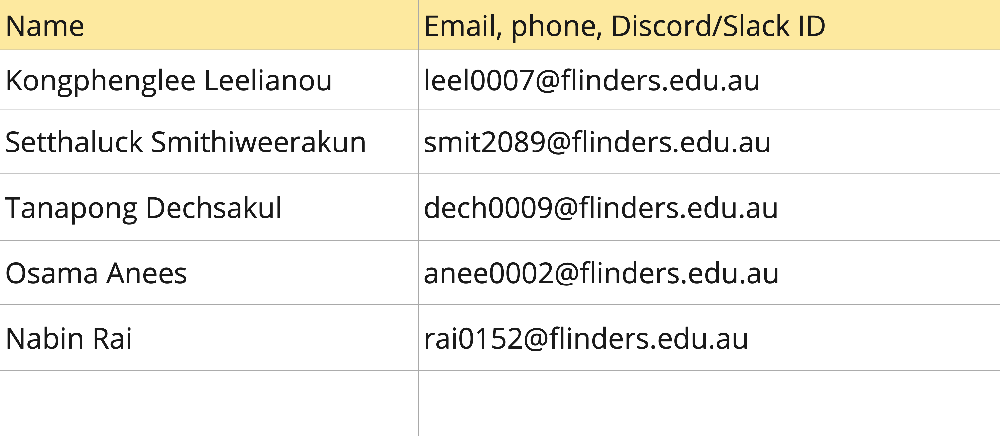

# Group 15:

# Project Structure Explanation:
- public: store public files that can be accessible to all people such as images, icons, and fonts.
    - icons: This sub-directory is used to store all icon files.
    - images: This sub-directory is used to store all images for this project.
- scripts: store all Javascript files that contains Javascript functions for the project.
- styles: store all the styling files (.css files) for the project. Within this directory, global.css file contains all the common styles that can be applied to all HTML files.
- pages: store all individual pages that will be integrated into one website.
- index.html: located in the root folder and is the file that will be the point of first entry of the website.

# References
CSS-tricks. _CSS articles_. https://css-tricks.com

Mental Health America. (n.d.). _How do colors in my home change my mood? Color psychology explained_. Mental Health America. https://mhanational.org/surroundings/color-psychology-explained

OpenAI, (2024). ChatGPT (GPT-4o version) [Large language model]. https://chat.openai.com/chat. "Generate a logo that represents a mental health journalling web application. Use the purple colour and make a transparent background. It should include CaRe word."

Pexels. (n.d.). _Woman in collared shirt_ [Painting]. Pexels. https://www.pexels.com/photo/woman-in-collared-shirt-774909/

Pexels. (n.d.). _Woman smilling_ [Painting]. Pexels. https://www.pexels.com/photo/woman-smiling-1102341/

Pexels. (n.d.). _Man standing on street_ [Painting]. Pexels. https://www.pexels.com/photo/man-standing-on-street-839011/

Pexels. (n.d). _Closeup photo of woman with brown coat and gray top_ [Painting]. Pexels. https://www.pexels.com/photo/closeup-photo-of-woman-with-brown-coat-and-gray-top-733872/

Pexels. (n.d.). _Man crossed arms_ [Painting]. Pexels. https://www.pexels.com/photo/man-crossed-arms-1516680/

Pexels. (n.d.). _Man wearing white dress shirt and black blazer_ [Painting]. Pexels. https://www.pexels.com/photo/man-wearing-white-dress-shirt-and-black-blazer-2182970/

Pexels. (n.d.). _Man takes selfie_ [Painting]. Pexels. https://www.pexels.com/photo/man-takes-selfie-1680175/

Pexels. (n.d.). _Man wearing plaid dress shirt_ [Painting]. Pexels. https://www.pexels.com/photo/man-wearing-plaid-dress-shirt-769733/

Pexels. (n.d.). _Closeup photo of smiling woman wearing blue denim jacket_ [Painting]. Pexels. https://www.pexels.com/photo/closeup-photo-of-smiling-woman-wearing-blue-denim-jacket-1130626/

Pexels. (n.d.). _Closeup photography of a woman near wall_ [Painting]. Pexels. https://www.pexels.com/photo/close-up-photography-of-a-woman-near-wall-1065084/

Pexels. (n.d.). _Man wearing eyeglasses_ [Painting]. Pexels. https://www.pexels.com/photo/man-wearing-eyeglasses-262391/

Pexels. (n.d.). _Woman wearing white shirt_ [Painting]. Pexels. https://www.pexels.com/photo/woman-wearing-white-shirt-1181690/

Pexels. (n.d.). _Person in blue denim jacket sitting on chair while writing_ [Painting]. Pexels. https://www.pexels.com/photo/person-in-blue-denim-jacket-sitting-on-chair-while-writing-39866/

Pexels. (n.d.). _Smiling woman wearing earrings and black collared top_ [Painting]. Pexels. https://www.pexels.com/photo/smiling-woman-wearing-earrings-and-black-collared-top-1197132/

Pexels. (n.d.). _Portrait of an old man wearing brown fedora hat_ [Painting]. Pexels. https://www.pexels.com/photo/portrait-of-an-old-man-wearing-brown-fedora-hat-3863793/

Stackoverflow. (n.d.). Stackoverflow. https://stackoverflow.com/

W3docs. (n.d.). _JavaScript Drag-and-Drop: Simplified with interactive example_. W3docs. https://www.w3docs.com/learn-javascript/drag-and-drop-with-javascript.html

W3Schools. (n.d.). _HTML tutorial_. W3Schools. https://www.w3schools.com/html/default.asp

W3Schools. (n.d.). _CSS tutorial_. W3Schools. https://www.w3schools.com/css/default.asp

W3Schools. (n.d.). _Javascript tutorial_. W3Schools. https://www.w3schools.com/js/default.asp